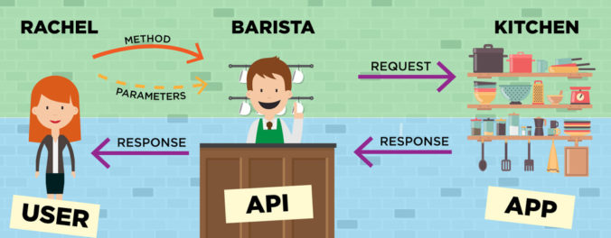

# API

Uma **API** (Application Programming Interface) ou _**Interface de Programação de Aplicações**_ é um conjunto de rotinas e padrões que fornecem meios de comunicação para um sistema. Fazendo assim, com que ele possa fornecer informações e serviços para outros sistemas; sem que esses outros precisem conhecer detalhes de como essas informações ou serviços serão manipulados.


*fonte:<https://programathor.com.br/blog/o-que-e-api/>*

Basicamente, ao consumir dados através de uma API, uma aplicação precisa fornecer unicamente detalhes sobre as informações que deseja imputar ou consultar em uma determinada URL (rota) e toda a mágica será feita pela aplicação de forma transparente.

Observe o exemplo do restaurante; o cliente por exemplo, conhece o cardápio, mas não precisa necessáriamente saber como o cozinheiro vai fazer sua comida. Então ele escolhe uma sopa, paga o valor necessário para consumir, e em pouco tempo a sopa chega até a sua mesa quentinha e pronta para ser consumida.
Assim são as aplicações clientes e nossas API's, quando você abre um APP de pedido de comida no seu celular, esse APP é o consumidor, ele primeiro pede uma lista de produtos disponiveis para a API e então a API envia para ele a lista sem que esse APP precise conhecer os relacionamentos entre entidades de banco de dados, nada; ele só mostra para recebe as informações dos produtos, valores, fornecedores, tempo para ser entregue, etc. Tudo pronto, assim como a sopa que o restaurante fornece ao seu cliente.

# REST

**REST** (Representational State Transfer) ou _**Transferência de Estado Representacional**_ é a capacidade que uma aplicação tem de se comunicar com outras utilizando representações como XML, JSON ou outros. Essas transferências são feitas utilizando métodos **HTTP** como **POST**, **GET**, **PUT** e **DELETE** que servem de meio de comunicação (interfaces) para transferência dessas representações de dados entre API e aplicações consumidoras. Assim, uma _**API REST**_ é justamente uma API que provê a troca de informações entre aplicações cliente -> servidor, em estados representacionais como o JSON.

## Request


Observe que o REST, além dos métodos, que são: As rotas para cada transação mais o verbo da transação; tem as fases da negociação. A primeira delas é o request que é a requisição onde se inicia uma nova transação.

Então, ainda seguindo o exemplo da nossa API, um cliente vai à um restaurante para comprar uma sopa. Ao chegar no balcão de atendimento, ele vai escolher seu pedido e fazer o pagamento por ele. Assim, na nossa API temos o POST, imagine que a rota é o cardápio onde nosso cliente vai escolher que tipo de sopa ele quer e o pagamento seja o estado representacional que ele vai fornecer (nesse caso dinheiro). Em programação o pagamento seria um estado representacional de algo que queremos consumir no caso da nossa API o estado que vamos usar serão informações em formato JSON. Na estrutura de um restaurante por exemplo, o dinheiro vai se transformar em sopa quando o dono do restaurando compra com o dinheiro os ingredientes da sopa e com o mesmo dinheiro paga o salário do cozinheiro da sopa e do garçon que irá servir-la ao cliente.

Abaixo um estado representacional de request (cliente -> servidor):

```

POST: http://restaurante/cardapio/sopadecebola

Estado representacional do pedido (JSON mas poderia ser XML ou outro) {
  produto: sopa,
  pagamento: valor_da_sopa
}

```


## Response


A segunda fase da negociação é o response que nada mais é do que a resposta à nossa requisição. Ainda no nosso restaurante, podemos imaginar os tipos de resposta. Imagine que o cliente fez um pagamento no cartão e não tinha saldo suficiente. Logo receberemos um 4XX onde o cliente não forneceu os dados corretamente e assim não pode comprar sua sopa pois as informações fornecidas no caso o pagamento, não foram condizentes com o esperado pelo nosso restaurante (API). No caso da nossa API teremos um pagina não encontrada 404 ou do restaurante a sopa não poderá ser vendida pois o cliente não pode pagar por ela.
Ainda podemos ter os casos onde o cliente conseguiu pagar, mas quando chegou enviou o pedido para a cosinha o garçon foi informado de que não tinham os ingredientes para a sopa e então tivemos um 500 (erro interno) e o restaurante não pode fazer a venda da sopa.
Por fim, temos o caso de sucesso onde o cliente escolheu a sopa o garçon informou que estava a caminho (200 OK) e então a sopa será entregue ao cliente que receberá assim o estado representacional que poderá ser consumido a SOPA.
No caso do nosso sistema.

```

Estado representacional do produto sendo servido (JSON mas poderia ser XML ou outro) {
  produto: "sopa de cebola quentinha"
}
```

Quando um sistema tem a capacidade de aplicar princípios REST é chamado **RESTFull**.

[Voltar](./sumario.md) <---- | ----> [Avançar](./02NodeJS.md)