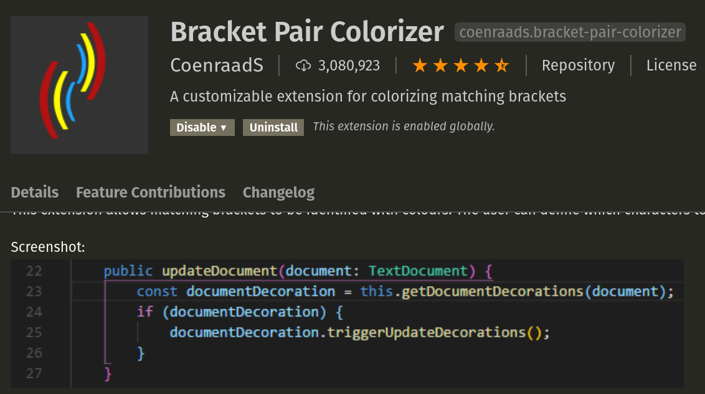
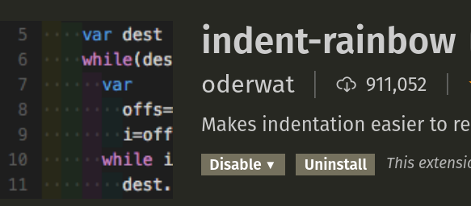
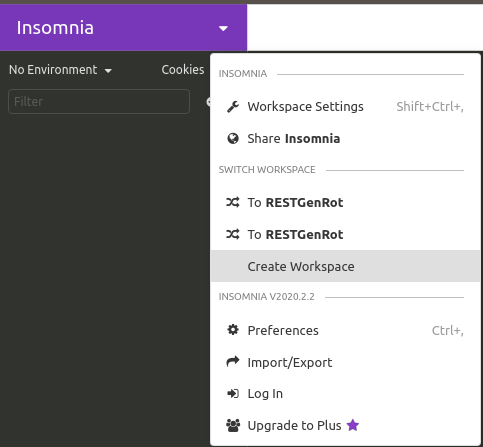
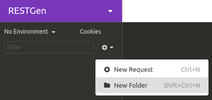
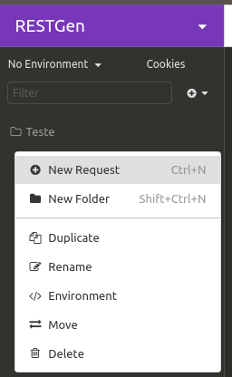
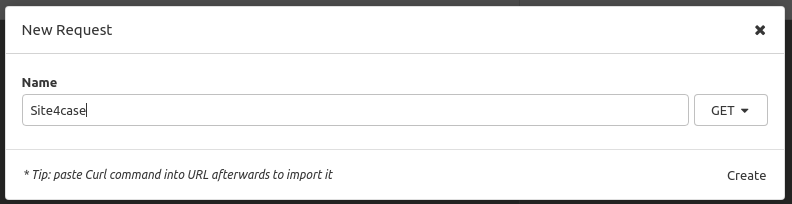
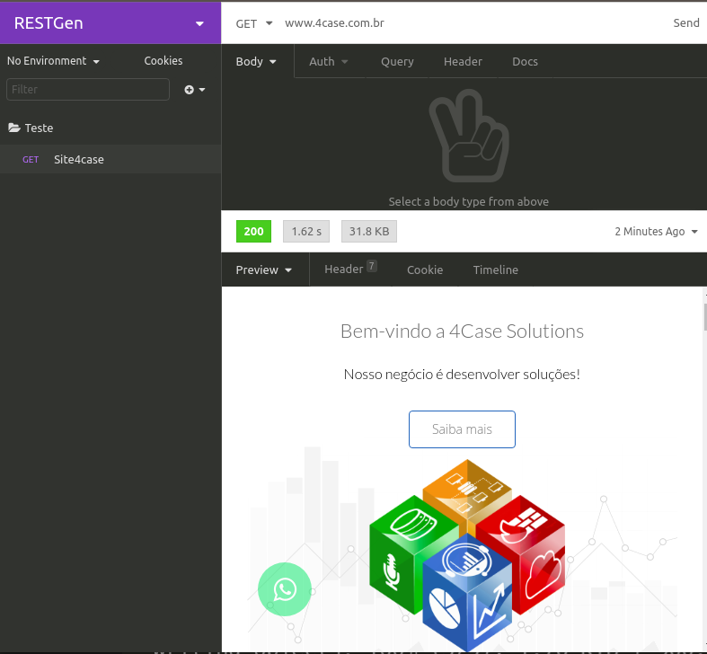

# Setup

## Ambiente virtual de desenvolvimento (setup)

O Setup de um programador deve conter programas, rotinas, plugins que lhe ajudem a ter produtividade e conforto. Pra quem está iniciando, gosto de indicar um Setup que me ajudou e continua me ajudando muito na minha evolução como progamador. Abaixo eu mostro os passos para "criar" um setup como o que eu uso.

## Instalação do VSCode no ubuntu

Uma outra taréfa importante para quem está pretendendo inicar uma aplicação, e ter um ambiente de desenvolvimento que nos possibilite agilidade no desenvolvimento e nas entregas de códigos legiveis e bem estruturados. Assim, a utilização de uma IDE como o (Visual Studio Code)[https://code.visualstudio.com/] é imprescindivel para quem está iniciando e para quem já é programador. O VSCode é um *canivete suiço* na vida do programador moderno. Além de possibilitar ganho de desempenho no desenvolvimento de projetos (graças à sua estrutura de visualização e navegação entre arquivos de código que compõem um sistema), ele também tem uma gama gigantesca de plugins que vão desde sugestões de auto-complete de códigos, find and replace em multiplos files, e até minificadores de código.

No ubuntu e derivados, a instalação do VSCode pode ser feita seguindo os passos abaixo:

> Vá até a pagina do VSCode https://code.visualstudio.com e faça o donwload no botão ".deb"

Depois de baixar, acesse o diretório onde fez o donwload do VSCode e instale seguindo os passos abaixo. No meu caso, o download foi feito em /home/usuario/Downloads

```
$ cd /home/alnetosilva/Downloads/
$ dpkg -i code_numero_da_versao_amd64.deb

```
*obs: onde está escrito "numero_da_versao" você coloca a versão do VSCode baixado. Recomendo o uso do <tab> para auto-completar.*

Uma vez instalado alguns plugins que podem te ajudar são:



Bracket Pair Colorizer: Colore aberturas e fechamentos de parenteses (), chaves {} e colchetes[] o que vai te ajudar a visualizar mais rápido onde iniciam e finalizam funções, blocos de código, arrays, entre outros.



Indent-rainbow: Colore as indentações de código deixando visualmente mais fácil idnetificar problemas de indentação.

## Insomnia

O insomnia é um REST client completo e fácil de usar. Através dele, vamos poder testar nossas API REST e todas as suas funcionalidades. Ele conta com uma interface completa para testar métodos REST como POST, GET, PUT e DELETE, além disso, podemos manipular URL's, cabeçalhos de resquisições e tudo que é necessário para usar uma API REST.

Para instalar o insomnia basta acessar o [site do projeto](https://insomnia.rest/download/) e fazer o download da versão Insomnia Core de acordo com o seu sistema operacional. No nosso caso, Ubuntu. Uma vez baixado o instalador, vamos instalar o nosso sistema.
```
$ sudo dpkg -i Insomnia.Core-2020.2.2.deb 
```

Uma vez instalado, podemos abrir o insomnia e criar nosso primeiro espaço de trabalho.


Uma boa prática é criar um workspace para cada projeto.



Uma outra boa prática é manter cada CRUD em um folder diferente. Por exemplo, o CRUD de usuários no folder de usuários.



E então, você pode criar os requests detro dessa folder de acordo com sua necessidade.



Você pode inclusive criar um request de acesso à um site expecífico




[Anterior](./02AmbienteDev.md) <---- | ----> [Avançar](./04NodeJS.md)